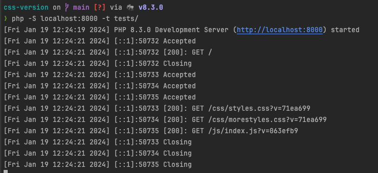

# css-version
This package performs versioning of the css files.

# Installation

`composer require elminson/css-version`

# After install execute

`composer run post-install-cmd`

This command will install the pre-commit file on .git folder

# How to use it
### in your core html template load the version

```php
<?php
$cssVersion = file_get_contents("css_version");
$jsVersion = file_get_contents("js_version");
?>


#implementation in all your css link href
<link href="<?=base_url();?>css/app.css?v=<?=$cssVersion?>" rel="stylesheet">
<link href="<?=base_url();?>css/morestyles.css?v=<?=$cssVersion?>" rel="stylesheet">

#implementation in all your js file
<script src="js/index.js?v=<?=$jsVersion?>"></script>

...
```


# running local test
```bash
$ php -S localhost:8000 -t tests/
```


